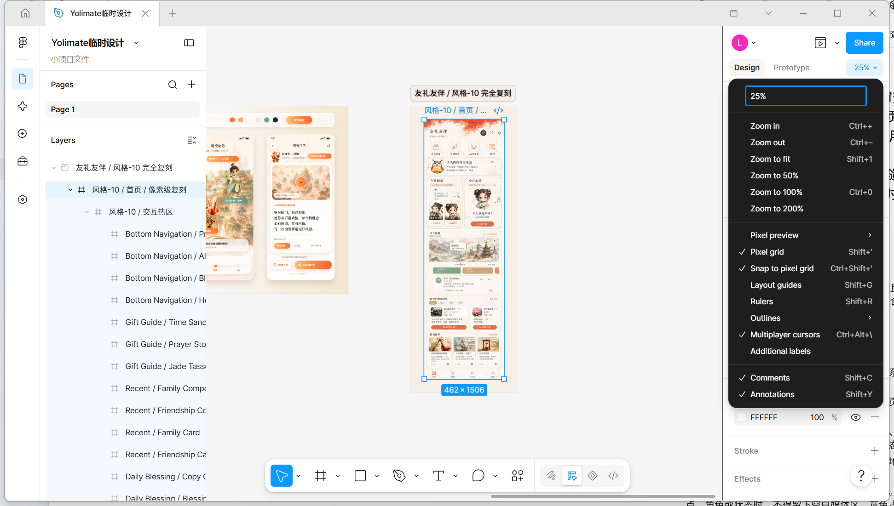
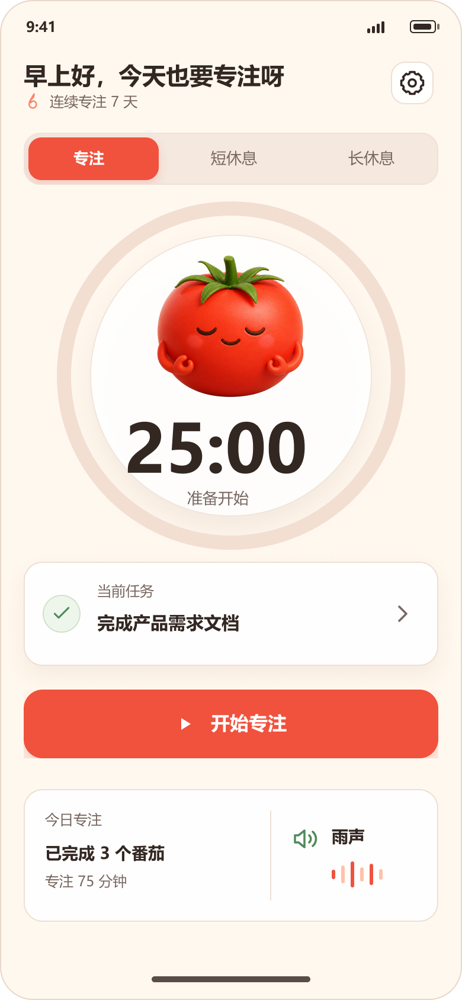

# 高保真 UI 设计 Skill

让 Codex、Claude Code、Cursor 等 AI Agent 在设计 UI 时，以可上线的高保真标准工作，并将参考图或文字需求交付为 **可编辑、可复用、可验证的 Figma 分层设计稿**。

[](LICENSE)
[](design-high-fidelity-ui/SKILL.md)



## 它解决什么问题？

对产品经理和 UI 设计师而言，AI 做 UI 常见有两类断层：

1. `GPT-Image` 能生成审美较好的整张 UI 图，但图片没有分层，后续改文案、挪按钮、换配图仍需要人工重做。
2. Figma Make 等原型工具能迅速做出可交互页面，但经常停留在“能讲清流程”的原型层面，视觉表现缺少可直接上线的完成度。

这个 Skill 把两者结合起来：先用高质量视觉素材建立审美锚点，再通过 Figma 原生节点重建可编辑界面，并以截图、节点回读和交互回读完成闭环验收。

它并不是让 Agent 把一张图片铺到画板上，而是要求它拆解为独立、可修改的图层：

- 文案为原生 `TEXT` 节点。
- 按钮、卡片、色块、边框、阴影和图标为独立 Figma 节点。
- 人物、场景、复杂插画等视觉素材为独立命名的图片图层。
- 热区不小于 `44 x 44`，原型交互可回读验证。
- 参考整图只可作为隐藏锁定的校准层，不能作为最终可见交付层。

## 核心方法

### 1. Figwright 让 Agent 直接操控 Figma

[Figwright](https://github.com/awdr74100/figwright) 是一个 MCP 服务器，使 Claude Code、Codex 等 Agent 能读写 Figma 文件、创建图层并配置原型交互。这个 Skill 在 Figma 场景中定义了更严格的工作合同：先建立页面结构和设计令牌，再写入节点，最后回读验证，而不是只看一次生成结果就结束。

### 2. 用 Loop Engineering 把“好看”变成可验收目标

一次生成通常只会满足“做一个页面”这一最低要求。Skill 把目标拆成能复查的验收项：准确视口、页面层级、文字、素材、命名、交互、最小热区、截图和节点结构。若视觉或结构不达标，Agent 应基于当前证据迭代，而不是宣称完成。

```text
设计合同 -> 设计系统 -> 原生节点搭建 -> Figma 回读 -> 截图对比 -> 修正 -> 验收
```

### 3. 用生图提升视觉表现，用原生节点保留编辑能力

当人物、产品或复杂场景是体验核心时，Skill 鼓励使用真实或生成的位图素材，而不是以装饰性 SVG 代替主体。生成的素材需要单独导入、命名并按 `FILL` 或 `FIT` 正确裁切；文字、控件和信息层仍保持为 Figma 原生可编辑节点。

在本项目的实践中，角色素材由 Codex 内置 `image_gen` 生成；不同客户端和版本的底层模型标识可能变化，因此本文不将某个具体模型版本作为该 Skill 的功能承诺。

## 实战案例

### A. 将高质量 UI 图复刻为可编辑的 Figma 分层稿

输入是一张国风风格 UI 参考图。交付不是整张截图，而是保留原图作为隐藏校准层，并将页面拆成原生文本、按钮、图标、卡片和独立视觉素材。这样可以直接在 Figma 修改字、图片位置、尺寸、颜色和组件样式。

| 参考图 | Figma 分层复刻稿 |
| --- | --- |
|  |  |

### B. 从文字需求生成可编辑高保真 UI

输入需求：设计一个“专注计时主页面”，选择温暖治愈的番茄钟方向。输出为 3 个 `390 x 844` 的可编辑 Figma 状态：默认、计时中、暂停；番茄角色为独立图片层，计时圆环、按钮、卡片、文案和图标均可单独调整。



该案例还配置了 5 组 Smart Animate 交互：

- 默认 -> 计时中
- 计时中 -> 暂停
- 暂停 -> 计时中
- 计时中停止 -> 默认
- 暂停停止 -> 默认

## 安装

### 方式一：让 Codex 直接安装

在 Codex 中发送：

```text
帮我安装这个 skill：https://github.com/JerryWoo/design-high-fidelity-ui-skill
```

### 方式二：使用 Skill 安装脚本

```powershell
python C:\Users\<你的用户名>\.codex\skills\.system\skill-installer\scripts\install-skill-from-github.py `
  --repo JerryWoo/design-high-fidelity-ui-skill `
  --path design-high-fidelity-ui
```

安装后在下一轮对话可用。若你使用其他 Agent，请将本仓库中的 [`design-high-fidelity-ui`](design-high-fidelity-ui) 文件夹放入该 Agent 的 Skills 目录。

## 使用方式

安装后，在需求中显式引用 Skill。

```text
使用 $design-high-fidelity-ui，设计并验证一个可上线的移动端番茄钟专注计时页面。
要求：温暖治愈风格；先生成高质量视觉素材；在 Figma 中创建可编辑分层稿；
按钮、图标、文字、配图均可单独调整；配置计时、暂停、停止的原型交互；
最后用截图和节点回读验证。
```

复刻参考图时：

```text
使用 $design-high-fidelity-ui，将这张 UI 图复刻到 Figma。
禁止把整张图作为可见成品；请逐个元素拆解，确保文字、按钮、图标、卡片、配图都能单独修改；
保留原图为隐藏锁定的校准层，并在完成后输出视觉对比和结构验收结果。
```

## Skill 内置标准

Skill 的详细规则在 [`design-high-fidelity-ui/SKILL.md`](design-high-fidelity-ui/SKILL.md)，核心包括：

- 先定义用户、视口、页面、内容层级、品牌信号和交互的验收合同。
- 先建立颜色、字体、间距、圆角、阴影、图标、动效和组件状态的精简设计系统。
- 不用营销落地页或静态说明替代用户真正需要的产品界面。
- 主体场景、人物、产品和地点必须有清晰可见的真实或生成素材。
- 控件、状态、导航、安全区、文字折行和响应式约束必须完整。
- 参考图复刻必须可编辑：不允许可见的整页截图充当最终交付。
- 写入 Figma 后必须回读节点与交互，并按目标视口截图进行视觉验收。

## 前置条件

- 一个支持 Skills 的 AI Agent，例如 Codex、Claude Code 或 Cursor。
- 若需要直接写入 Figma：已安装并连接 [Figwright](https://github.com/awdr74100/figwright)。
- 若页面需要独特的人物、场景或产品素材：可用的图像生成能力或已有品牌资产。

Skill 不会替代品牌策略、业务判断或真实用户研究；它负责将明确需求以更高的设计与交付标准落到可编辑的设计稿中。

## 仓库结构

```text
design-high-fidelity-ui-skill/
├── design-high-fidelity-ui/
│   ├── SKILL.md
│   ├── agents/openai.yaml
│   └── references/
│       ├── figma-workflow.md
│       └── quality-standard.md
├── docs/images/
├── README.md
└── LICENSE
```

## 许可

本项目采用 [MIT License](LICENSE)。

如果这个 Skill 对你有帮助，欢迎给仓库点一个 Star。
